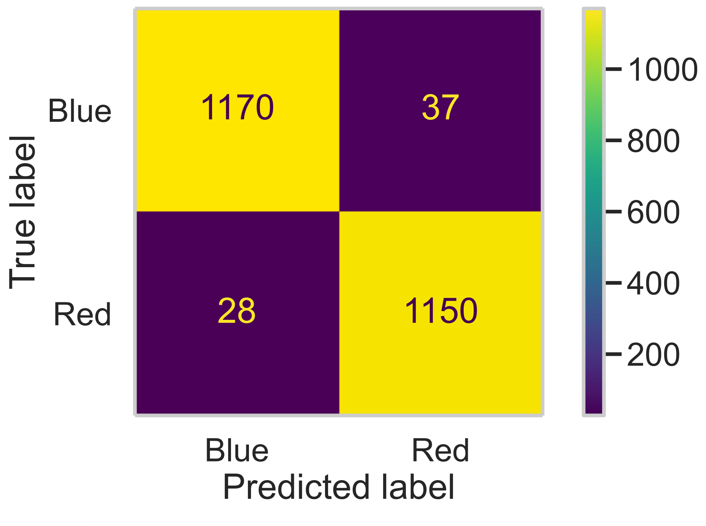
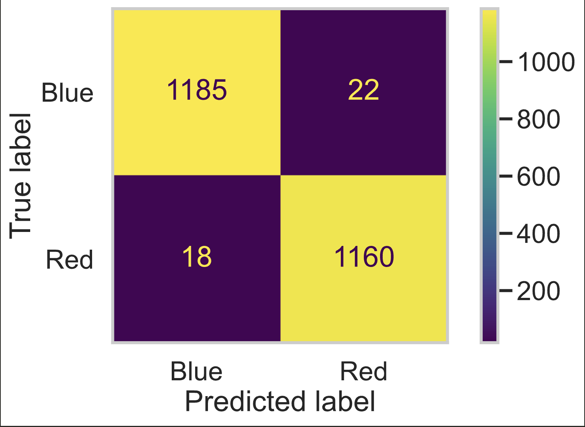

# Which Side Wins Red or Blue ?
By: Shriya Pattapu and Milo Palmquist 

## Introduction

### General Introduction
League of Legends is a multiplayer online battle arena game in which two teams of five play against each other with the objective of destroying the other team's base. The game has an extremely large player base, and there are many competitive leagues for professional teams. The dataset we are working with contains information from individual pro-play games that show both the performance overall and throughout the game for both the players and teams, as well as the result of each game.

For this project, we would like to answer the following question: **"Are you more likely to perform better if you are on the blue side?"**

In League of Legends, the map is square-shaped, and players play in three lanes. The top lane is along the left and top edges, the bottom lane is along the right and bottom edges, and the mid lane is along the diagonal from the bottom left corner to the top right one. Each side's base is situated at one of these two corners, with the blue side at the bottom and the red side at the top. Which side a team is on is determined randomly at the start of the game.

In the League of Legends community, many players think that there is an advantage to being on the blue side. This may be attributed to the way the in-game display is set up, as there are generally more features at the bottom of a player's screen, and this may hinder players on the red side's ability to smoothly interact with the part of the screen where their enemies will show up a majority of the game.

Using this dataset, we can see if even the best of the best are safe from the alleged effect of this coin flip. Assuming the skills of each team are similar, then the proportion of wins on one side should not be significantly different from the other.

### Introduction of Columns
The dataset has several columns, and the main ones we will focus on are:

- **`gameid`**: A unique identifier of the each game played between two teams.
- **`league`**: The string that denotes the name of the specific league tournament in which the match took place.
- **`side`**: The side of the map that a particular team within a game played on. 'side' is always 'Blue' or 'Red' in our data.
- **`teamname`**: A string of the name of the team playing the game.
- **`result`**: A binary column set to 1 indicating a team won and 0 indicating a team lost that game.
- **`earnedgold`**: The amount of gold earned excluding starting gold, and passive gold.
- **`teamkills`**: The total number of times a team successfully killed an enemy champion during the game.
- **`gamelength`**: The length of a game in seconds. 
- **`damagetochampions`**: The total amount of damage given to enemy champions on each team during the game.
- **`xpat25`**: a measure of how much experience a player has accumulated by the 25-minute mark, reflecting their overall level progression and efficiency in gaining XP compared to the average or their opponent.
- **`csat25`**:  a measure of how many minions and monsters a team has killed by the 25-minute mark, which contributes to gold and experience gain.
- **`dragons`**: The number of dragons secured by the team during the game.
- **`barons`**: The number of barons secured by the team during the game.

## Data Cleaning and Exploratory Data Analysis

### Data Cleaning:
The original dataset contains data that pertains to individual players of a team as well as data relavent to the team as a whole. So only kept data pertaining to the entire team within a game rather then all the players. This significantly reduces the amount of rows within out cleaned data. We also only wanted data pertaining to complete games, not partial games, as partial games do not contain timed data like creep score or xp at different times which is why we chose to excluded it. We also decided to convert the gamelength column from seconds to minutes for better readability. 

We only train our final model on games that are 25 minutes or longer, so later in our prediction models, we queried out games with a 'gamelength' less than 25 minutes in order to ensure there are no missing values in xpat25 or csat25. Most games are longer then 25 minutes and on average games are 30 minutes, we want our final model to make classifications for majority of games, not outliers. 

Here’s the first five rows of the cleaned dataset named teams:

| gameid                | league   | side   | teamname                 | gamelength   |   result |   teamkills |   earnedgold |   damagetochampions |   xpat25 |   csat25 |   dragons |   barons |
|:----------------------|:---------|:-------|:-------------------------|:-------------|---------:|------------:|-------------:|--------------------:|---------:|---------:|----------:|---------:|
| ESPORTSTMNT01_2690210 | LCKC     | Blue   | BRION Challengers        | 00:28:33     |        0 |           9 |        28222 |               56560 |    45960 |      767 |         1 |        0 |
| ESPORTSTMNT01_2690210 | LCKC     | Red    | Nongshim Esports Academy | 00:28:33     |        1 |          19 |        33769 |               79912 |    49931 |      864 |         3 |        0 |
| ESPORTSTMNT01_2690219 | LCKC     | Blue   | T1 Esports Academy       | 00:35:14     |        0 |           3 |        34688 |               59579 |    49409 |      895 |         1 |        0 |
| ESPORTSTMNT01_2690219 | LCKC     | Red    | Liiv SANDBOX Youth       | 00:35:14     |        1 |          16 |        48063 |               74855 |    57155 |      928 |         4 |        2 |
| ESPORTSTMNT01_2690227 | LCKC     | Blue   | KT Rolster Challengers   | 00:32:52     |        1 |          14 |        41372 |               67376 |    52441 |      912 |         4 |        1 |

### Univariate Analysis:
We conducted a univariate analysis on the earned gold per team. 
<iframe src="assets/EarnedGold.html" width="620" height="420" frameborder="0"></iframe> 
The histogram shows a normal distribution meaning that earned gold per team is symmetrically distributed around the mean. The normal shape also implies that earned gold is likely independently and identically distributed (i.i.d.), indicating that the underlying process generating earned gold is consistent and stable across teams, therefore is a reliable statistic for analyzing team behavior.

We also conducted a univariate analysis on the team kills per team. 
<iframe src="assets/TeamKills.html" width="620" height="420" frameborder="0"></iframe> 
The histogram shows a relativley normal distribution that is right-skewed meaning that team kills per team is mostly symmetrically distributed around the mean though the mean is lower and few teams obtain an excpetionally high number of kills. The relativley normal shape also implies that team kills is likely independently and identically distributed (i.i.d.), the way players obtain kills is relavtively consistent across teams (though some are much higher) and, therefore is a reliable statistic for analyzing team behavior.

### Bivariate Analysis:
For our bivariate analysis, we decided to focus on **`side`** which is central to much of our analysis later on, and may potentially provide insights about the data.  

In this first visualization, we look at how earned gold varies depending on the side a team is on. 
<iframe src="assets/EarnedGoldSide.html" width="620" height="420" frameborder="0"></iframe> 
Both overlapping distributions are still normal, so we can ascertain the same as prior as well as the fact side is likely not a strong indicator of earned gold. 

In this second visualization, we look at how team kills varies depending on the side a team is on. 
<iframe src="assets/TeamKillsSide.html" width="620" height="420" frameborder="0"></iframe> 
Both overlapping distributions still have a similar overall direction, but the shape of the distributions look slightly different which may suggest that teamkills could be an indicator of side. It's at least likely a stronger indicator of side then earned gold. 

### Interesting Aggregates
Here are some intresting aggregates we can explore within the data: 

| side   |   result |   teamkills |   earnedgold |   damagetochampions |   xpat25 |   csat25 |   dragons |   barons |
|:-------|---------:|------------:|-------------:|--------------------:|---------:|---------:|----------:|---------:|
| Blue   | 0.523086 |     14.8736 |      36566.6 |             67612.1 |  51893.3 |  820.958 |   2.14002 | 0.669482 |
| Red    | 0.476914 |     14.3222 |      35947.7 |             66651.5 |  51831.3 |  822.529 |   2.35135 | 0.681588 |

We grouped by side in order to see the difference in statistics between teams on the blue vs. red side, we then gathered the quantitiave columns in order to find the means of each statistic with respect to side. This way we can see the differences in averages between each statistic with respect to side. Here we find that, the teams on Blue side tend to win more, has more team kills, has more earned gold, gives more damage to enemy champions, more xp at 25 minutes on average but Red side has more dragons, more barons and a larger creep score at 25 minutes on average then Blue side. Though when looking at these aggregate, we do have to realize that these differences in averages are marginal. 

## Assessment of Missingness

### NMAR Analysis
We do not think there are any columns in the dataset that are NMAR. We believe that all of the missing data is either missing by design or MAR. Because the original dataset includes data for both invidual players and the teams they are on, columns that only contain aggregate team data are empty for rows containing player data, and columns that only contain individual player data are empty for rows containing team data. There are also null values in the columns containing ban information for each team if they banned less than five champions, but these cells are intentionally left empty because there is no data to enter. Additionally, since many columns in the dataset are related to game statistics at certain times in the game, there will be missing data in those columns if a game ends before that time. In this case, the missingness in this column is dependent on the game length, which is also included in the dataset. There are also rows missing data in all of these time columns, but they all rows containing data from League of Legends Pro League (LPL) games, and these rows also have the value 'partial' in the datacompletenesscolumn, therefore this data is also MAR.

### Missingness Dependency
In this subsection, we will test if the missingness of the **`xpat25`** column depends on other columns. The other two columns that we will check our missingness dependency on are **`side`**, and **`gamelength`**. 

First, let's take a look wether the missingness of **`xpat25`** is dependent on **`gamelength`**. 

**Null Hypothesis:** The distribution of **`gamelength`** when **`xpat25`** is missing is the same as the distribution of **`gamelength`** when **`xpat25`** is not missing. 

**Alternative Hypothesis:** The distribution of **`gamelength`** when **`xpat25`** is missing is **not** the same as the distribution of **`gamelength`** when **`xpat25`** is not missing. 

**Test Statistic:** Kolmogorov-Smirnov Test Statistic

**Significance Level:** 0.5

Subsequent to the permutation tests, we find that the observed statistic is 0.992025507599341, with a p-value of 0. The empirical distribution of the K-S statistic is shown below. 
<iframe src="assets/EDKS.html" width="620" height="420" frameborder="0"></iframe> 
In this permutation test, the p-value is less than the 0.5 which means we reject the null hypothesis. Therefore, the missingness of the **`xpat25`** column does infact depend on the gamelength column.

Now, let's take a look wether the missingness of **`xpat25`** is dependent on **`side`**. 

**Null Hypothesis:** The distribution of **`side`** when **`xpat25`** is missing is the same as the distribution of **`side`** when **`xpat25`** is not missing. 

**Alternative Hypothesis:** The distribution of **`side`** when **`xpat25`** is missing is **not** the same as the distribution of **`side`** when **`xpat25`** is not missing. 

**Test Statistic:** Total Variation Distance

**Significance Level:** 0.5

The distribution of **`side`** when **`xpat25`** is missing and the distribution of **`side`** when **`xpat25`** is not missing are shown below: 

| side   |   xpat25_missing = False |   xpat25_missing = True |
|:-------|-------------------------:|------------------------:|
| Blue   |                  0.50005 |                0.499253 |
| Red    |                  0.49995 |                0.500747 |

Subsequent to the permutation tests, we find that the observed statistic is 0.992025507599341, with a p-value of 0. The empirical distribution of the Total Variation Test statistic is shown below. 
<iframe src="assets/EDTVD.html" width="620" height="420" frameborder="0"></iframe> 
In this permutation test, the p-value is greater than the 0.5 which means we fail to reject the null hypothesis. Therefore, the missingness of the **`xpat25`** column does not depend on the **`side`** column.

## Hypothesis Testing

In our hypothesis test, we aim to determine whether there is a significant difference between the average team kills for the blue side and the red side. We want to understand the relationship between being on the red or blue side and the average kills per side. The motivation comes from wanting to determine whether the blue side is actually more likely to win than the red side, as team kills are likely related to the game outcome, making this an important test to explore.

**Null Hypothesis**: Team kills of teams on the blue side and teams on the red side have the same distribution.

**Alternative Hypothesis**: Team kills of teams on the blue side and teams on the red side are distributed differently.

**Test Statistic**: Difference in Means of team kills for blue side and team kills for red side.

**Significance Level**: 0.05

Below is the sampling distribution for the test statistic:
<iframe src="assets/HypTestDist.html" width="620" height="420" frameborder="0"></iframe>

As a result of the hypothesis test that we performed, we achieved a p-value of 0.0. Thus we reject the null hypothesis, which indicates that team kills of teams on the blue side and teams on the red side are distributed differently. As a result we can infer that although side is randomly assigned to teams during a game, the side of the map a team is on in-game may have an affect on game-play statistics and results of matches.

## Framing a Prediction Problem

Previously, we have found that team kills of teams on the blue side and teams on the red side are distributed differently. Since statistics for blue and red side are different, are there specific statistics of gameplay like **`xpat25`**, **`csat25`**, **`barons`**, **`dragons`**, etc. that are higher as a result of being on blue or red side; Can we use these statistics to predict which side the player was on?

To address this question, we pose this prediction problem that can be answered with a binary classification model: Based on the difference in in-game statistics can we predict wether the winning side of a game was blue or red?. This allows for our classification model to have more accurate measures of differences between sides as apposed to general in-game statistics that are not in relation to the other side. Thus our response variable is wether the winner was red or blue which is included in the differences between team statistics dataframe. A few rows of this dataframe a pictured below:

|   teamkills |   earnedgold |   damagetochampions |   xpat25 |   csat25 |   dragons |   barons |
|------------:|-------------:|--------------------:|---------:|---------:|----------:|---------:|
|         -10 |        -5547 |              -23352 |    -3971 |      -97 |        -2 |       -0 |
|         -13 |       -13375 |              -15276 |    -7746 |      -33 |        -3 |       -2 |
|           9 |        10691 |               21256 |     2532 |        5 |         3 |        1 |
|           3 |        -8804 |               14285 |    -3725 |      -35 |         2 |       -2 |
|           5 |        10871 |               20942 |     1338 |      -16 |        -3 |        1 |

The response variable that our model will predict is what the winning side a individual game is. We chose this as our response variable, because the game randomly assigns side to teams at the start of a game, but many players have an underlying opinion that blue side teams is more likely to win than red side teams. Furthermore, many players prefer to be on the blue side rather than the red side, for there is increased visibility of the map, unobstructed side bars. blue side also has first pick in the champion they chose in the draft, which could potentially give them an advantage.

We decided to use both F-1 Score and accuracy in our model's evaluation.The actual distribution of blue side wins and red side wins is slightly unbalanced with red side winning 48% of the time and blue side winning 52% of the time. We want to ensure that our modeling is not overpredicting blue side wins, which is why we also want to use F-1 score to account for the slight underreprentation of red side wins. Using F-1 score we will be evaluated, how well our model predicts both blue and red side wins.

The information that we would know at the time of prediction for the final model is the differences between the statistics for **`teamkills`**, **`earnedgold`**, **`damagetochampions`**, **`xpat25`**, **`csat25`**, **`dragons`**, and **`barons`**, differences between the statistics for **`teamkills`**, **`earnedgold`**, for the basline model. 

## Baseline Model

For the baseline model, we used a Random Forest Classifier, with two features: **`teamkills`** and **`earnedgold`**. Both of these features are quantitative, which meant that we didn't need to perform any encodings. Though because of the struture of the teams dataframe, which has two rows per game, one for each team that played, we found the differences between statistics per game between both team, which I addressed in the above section. 

The current model is good with an accuracy of 0.9748. The model currently accuratly predicts 97.5% of the data. The F-1 score for this model is also good with a score of 0.9748 and similar to the accuracy. This means that the recall and percision are also relativley high, which make our baseline model already pretty accurate. 
This can be seen in the confusion matrix below. 

  

## Final Model

In our final model, we added the following features: **`damagetochampions`**, **`xpat25`**, **`csat25`**, **`dragons`**, and **`barons`** in addition to the features in our baseline model. 

We tried to choose features that have an impact of the whether a side wins or not. Focusing on objectives like taking barons, and dragons can give teams a significant advantage, as by killing them teams get additional buffs and advantages when they are killed. Killing dragons can create buffs for the entire teams and killing it before the opposing team can allow that team to deny the opposing team buffs. Dragons killed can give a team significant advantages through the game is likely to be related to which team wins.

Barons are a similar neutral objectives in game but the advantage it provides is even greater then dragons. The Baron buff gives a team super minions in every lane on the map, this makes easier for the team with this buff to push down lanes and take enemy towers. Since barons provide massive advantage, the team that takes more barons (Barons respawn in the game though there is only one at a time), likely has a substainial advantage, and have a higher chance of winning. 

**`damagetochampions`** is vital to winning a game, as dealing more damage will allow a team to win team fights. Overall, by dealing more damage to champions on the opposing team, a team will have a greater chance of taking other objectives like barons and dragons since the other team is weaker. 

Having a higher **`xpat25`** will mean that champions of a particular team are stronger than the other, giving level advantages to players within a team, which contributes to their ability to win. 

**`csat25`** refers to creep score at 25 minutes, which is how many minions a team has killed at the 25 minute mark. Creep score has an impact on gold generation, and item advantages which will give teams with high creepscore and advantage in team fights and objectives as mentioned before.

Therefore, we expect that these additional features will provide our model with the needed information to predict which side won. 

Our final model uses a Random Forest Classifier, consistent with our baseline model, with 4 additional features as mentioned above. The hyperparameters that ended up performing best were a max depth of 15 and 500 n_estimators. We reached this conclusion by conducting a GridSearchCV on our model using two hyperparamters, max_depth and n_estimators, we tried a combination of other hyperparameters that failed to improve our model. We tested n_estimators on values 100 to 500, with a step count of 100, and max depth on these values here: 2, 5, 10, 15, None. 

The accuracy score of our model now is 0.9836, which means that our model accurately predicts 98.3% of our data. The F-1 score of our model is also 0.9836 which means that our percision and recall scores are even closer to one then before. Though the improvment is small, our model predicts even more games correctly then in our baseline model. 
An image of of the confusion matrix for our final model pictured below:  

  

## Fairness Analysis
In this section we want to evaluate wether or not our model is fair, meaning that it performs the same for games within a group and games outside of the group.

Does our model perform suboptimally for games played in the Korean leagues (LCK and LCKC) compared to other leagues?

**Group X:** Games played within Korean leagues

**Group Y:** Games played outside of Korean leagues

**Evaluation Metric:** Accuracy

**Null Hypothesis:** Our model is fair, and its accuracy between games played in the Korean leagues and games played in the others leagues is the same.

**Alternative Hypothesis:** Our model is not fair, and its accuracy for games played in the Korean leagues are greater then for games played in the others leagues.

**Test-Stat:** Difference in accuracy (Not Korean - Korean)

**Significance Level:** 0.05

<iframe src="assets/fairness.html" width="620" height="420" frameborder="0"></iframe>

After performing a permuatation test, we got a resulting p-value of 0.77, which is greater than our siginficance value, meaning we fail to reject our null hypothesis. This means that our model maintains a similar accuracy score for games played within Korean league and outside Korean league, meaning our model is fair and unbiased towards Korean league games. 